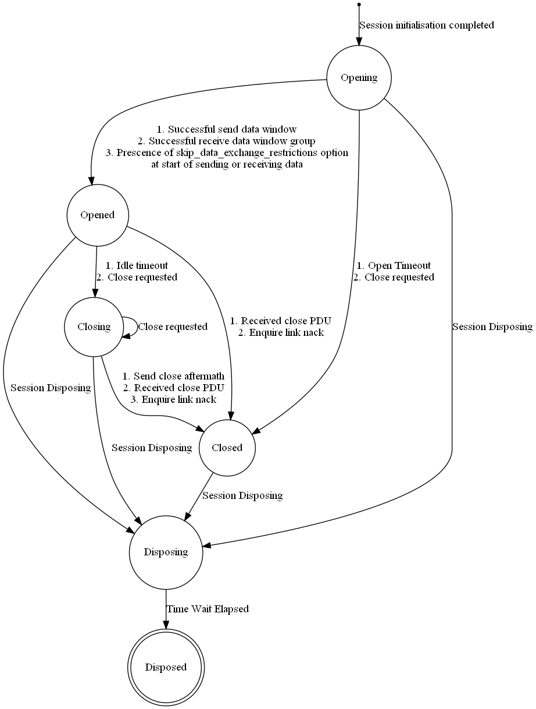

# ScalableIPC Protocol

Defines and implements an application layer network protocol to serve as 

   1. OS-neutral IPC mechanism of choice on a single host machine (localhost)
   2. Protocol of choice for use on internal/backend networks of applications running on the Internet.
   3. Common interface to pluggable underlying networks for HTTP, in order to dissociate HTTP from TCP, and leverage any alternative underlying network available which may be more efficient depending on the context (e.g. on a single host machine).
   
The initial motivation for this protocol came from deliberations on IPC efficiency between microservice-based web applications.

## Features

  * Uses multiplexed TCP/TLS by default. In general however, underlying network is an abstraction for the protocol, and hence it can be used on top of any network, even over unreliable ones, depending on the context.
  * Enables multiplexing regardless of underlying network by using application layer session ids.
  * Places upper bound on TCP TIME_WAIT state count when using multiplexed TCP. In contrast when non-persistent HTTP connections are being used, TIME_WAIT states just keep increasing and hogging ports per TCP design, for time period of MSL value of 1 minute or more.
  * Exposes configuration parameters such as maximum window size, MTU, idle/ack timeout, and maximum retry attempts on a per application basis, and thus makes the protocol adaptable to a wide range of networking needs. When using TCP directly however, such parameters can only be configured globally for all operating system connections.
  * Makes streaming and duplex communication easier at application layer, by

     * enabling idle timeout to be applied or disabled per session.
     * treating all errors as transient, so that sessions persist in spite of errors. Sessions also persist without the need for keep-alive packets.
     * preserving message boundaries like in UDP.

  * Optimized for networking within single host machine by using faster IPC mechanisms where available, such as UDP, Unix domain sockets and Windows named pipes. *By such a design, the protocol can be set up once for networking on single host machine, and will not have to be swapped out for interhost network communications.* Hence the name **ScalableIPC**, i.e. it can scale *down* from global internetworking to localhost internetworking; and also scale *up* from localhost to global.

  * Designed to make maximum utilisation of "long fat networks", ie internal networks with large bandwidth-delay products.

## Protocol State Machine

**NB:**

   - calling ISessionHandler.CompleteInit launches the opening state.

   - in opening state only data pdus are processed; all others are ignored.

   - in opened state, data pdus are processed normally. enquire link pdus are processed by sending back enquire link acks.

      - Also enquire link pdus are sent out periodically without waiting for reply or even network send aftermath.

   - beyond opened state (ie when session handler is disposing), data or enquire link pdus are processed by sending back enquire link NACKs. close pdus are ignored (except in closing state).

## Roadmap

 * C#.NET Core implementation is currently underway as the initial implementation.
 * Once initial implementation is done, the intention is to port to Java and NodeJS. To do this, initial implementation has been designed to work with blocking or non-blocking I/O (using abstraction of NodeJs promise and C#.NET Core TaskCompletionSource), in single or multithreaded environments (using abstraction of NodeJS event loop). By such a design, porting to other programming environments should be straightforward.
